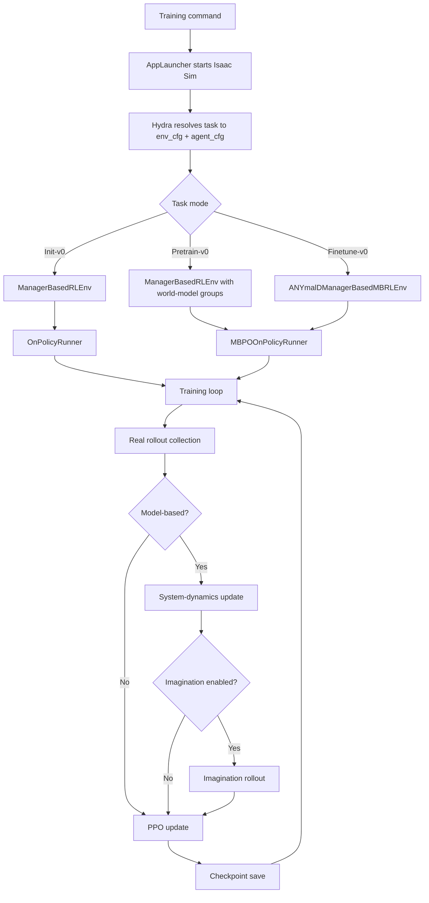

# Runtime Pipeline

This page is the temporal walkthrough of execution: what happens, in what order, from the training command to the checkpoint save. The runtime branches by task mode at two points; both branches are surfaced below.

The architectural detail of each component (what `SystemDynamicsEnsemble` looks like internally, what the loss decomposition is, how the residual prediction works) lives in [Implementation Analysis](implementation-analysis.md). This page describes *when* things happen; that page describes *what they are*.

## Flow at a glance



## 1. Training command

The entrypoint is `upstream/robotic_world_model/scripts/reinforcement_learning/rsl_rl/train.py`. It is invoked indirectly through the Isaac Lab launcher (`isaaclab.sh -p <script>`), which sets up the Omniverse Python path before the script imports anything.

The script parses CLI arguments (notably `--task` and `--headless`), launches the simulator via `AppLauncher`, and imports `mbrl.tasks` so that the project's custom tasks register themselves with `gym`. The training function is then called via the `@hydra_task_config(args_cli.task, "rsl_rl_cfg_entry_point")` decorator, which resolves the task ID into matching environment and agent configuration objects.

The task ID is the only argument that materially changes what runs next. Everything downstream is determined by the configuration that ID resolves to.

## 2. Task resolution

Hydra reads the task registry in `source/mbrl/mbrl/tasks/manager_based/locomotion/velocity/config/anymal_d/__init__.py` and produces two configuration objects: an environment config (`AnymalDFlatEnvCfg_INIT`, `_PRETRAIN`, `_FINETUNE`, or `_VISUALIZE`) and a runner config (`AnymalDFlatPPORunnerCfg`, `AnymalDFlatPPOPretrainRunnerCfg`, etc.).

The environment config determines which observation groups exist, what the reward terms are, and what termination conditions apply. The runner config determines which runner class is used, whether the system-dynamics model is constructed, what the imagination scale is, and where checkpoints are loaded from. The two configs are independent inputs; their combination defines the run.

For the per-task differences between configurations, see [Task Modes](task-modes.md).

## 3. Environment creation

The script constructs the environment with `gym.make(args_cli.task, cfg=env_cfg, ...)`. The task ID determines the environment class:

- `Init-v0` and `Pretrain-v0` use the standard Isaac Lab `ManagerBasedRLEnv`.
- `Finetune-v0` and `Visualize-v0` use the custom `ANYmalDManagerBasedMBRLEnv`, which extends the standard env with `imagination_step()` and reward reconstruction methods.

The environment is then wrapped with `RslRlVecEnvWrapper` to satisfy the runner's interface contract. This is infrastructure, not method content.

## 4. Runner selection

The runner class is read from `agent_cfg.class_name` and instantiated. Two possibilities:

- `OnPolicyRunner` (standard PPO) is used by `Init-v0`.
- `MBPOOnPolicyRunner` is used by `Pretrain-v0`, `Finetune-v0`, and `Visualize-v0`.

For the model-based runner, instantiation triggers construction of three additional components beyond what standard PPO would set up: a `SystemDynamicsEnsemble` (the world model), state and action `EmpiricalNormalization` modules, and an imagination storage buffer (allocated even if imagination is disabled, to keep the interface uniform).

The runner also injects several attributes into the environment via `env.unwrapped`: the dynamics model itself, the normalizers, and the imagination configuration parameters. This injection is what lets the custom MBRL environment access the learned model when computing imagined transitions. From an architecture standpoint it is the bridge between the RL backend and the simulator interface.

## 5. Training loop: real rollout

Each iteration of the training loop begins by collecting real-environment rollouts. For each step in the rollout horizon, the policy samples actions from the current observation, the environment steps, and the resulting transition (observation, action, reward, done, info) is recorded.

For model-based runners, the same real transitions are also pushed into the system-dynamics replay buffer via `self.alg.fill_history_buffer(obs)`. This is where the data for world-model training accumulates. The transitions are stored in normalized state and action space, which is consistent with how the dynamics model itself operates.

For non-model-based runners (`Init-v0`), this step ends here and the loop proceeds directly to the PPO update.

## 6. Training loop: system-dynamics update

This step exists only for model-based runners. After real rollout collection, `self.alg.update_system_dynamics()` is called.

The update samples sequences from the replay buffer, runs them through the dynamics model, computes a weighted multi-term loss, and updates the model with its own optimizer. The optimization is independent of the policy and value networks; the system-dynamics model has its own parameters and its own gradient flow.

The loss decomposition (state, contact, termination, bound, and others) is described in [Implementation Analysis](implementation-analysis.md).

## 7. Training loop: imagination rollout

This step exists only when imagination is enabled. In `Pretrain-v0` it is disabled (`num_imagination_envs = 0`); in `Finetune-v0` it is enabled at lab-scale settings.

The imagination rollout is structurally a parallel rollout in a different environment. Where the real rollout used the simulator, the imagination rollout uses the learned dynamics model as the simulator. The custom `ANYmalDManagerBasedMBRLEnv.imagination_step()` method orchestrates this:

1. Normalize the policy's chosen action.
2. Append the action to the action history maintained by the imagination buffer.
3. Call `system_dynamics.forward(state_history, action_history, ...)` to get predicted next state, contact logits, and termination logits.
4. Denormalize the predicted state.
5. Parse contact and termination predictions into boolean signals via sigmoid + rounding.
6. Reconstruct the reward terms from the predicted state and contacts (velocity tracking, torque penalty, action-rate penalty, foot clearance, and so on).
7. Apply imagined timeouts and terminations.
8. Reset imagined environments where needed.
9. Return the imagined observation to the runner.

The result is a batch of imagined transitions that can be used for PPO updates the same way real transitions can. The dynamics model functions as a simulator inside the loop. This is the core operational claim of the RWM method: the policy is optimized against trajectories generated by the learned model, not by the real simulator.

## 8. Training loop: PPO update

The PPO update is standard. The implementation in `rsl_rl_rwm/rsl_rl/algorithms/ppo.py` computes the clipped surrogate loss, the value loss, and the entropy bonus, and combines them into a single objective.

The only thing that changes between task modes is the source of the trajectories the update consumes. In `Init-v0` and `Pretrain-v0`, the trajectories come from real rollouts. In `Finetune-v0`, they come from imagined rollouts produced in step 7. The PPO algorithm itself does not know the difference.

## 9. Training loop: checkpoint save

At a configured interval, the runner serializes its state to disk. The model-based runner saves both the policy state and the dynamics model state in the same checkpoint file:

```text
model_state_dict
system_dynamics_state_dict
optimizer_state_dict
system_dynamics_optimizer_state_dict
iter
infos
```

This is what allows `Finetune-v0` to load a pretrained dynamics model from a `Pretrain-v0` checkpoint via the `load_system_dynamics` flag. The two stages share the checkpoint format precisely so the artifact passes cleanly between them.

The current per-task status of these stages, and the artifacts that exist or are missing, is tracked in [Reproduction Status](../validation/reproduction-status.md).